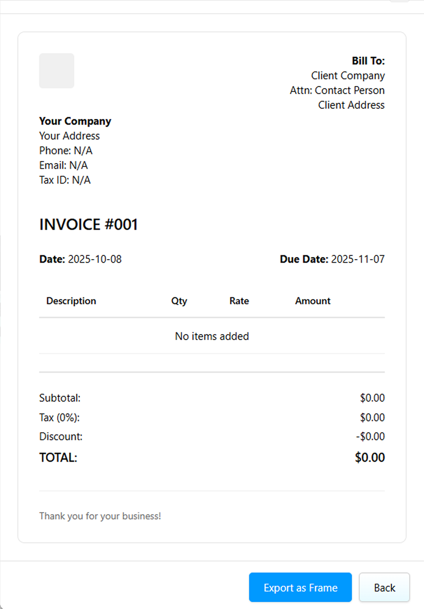
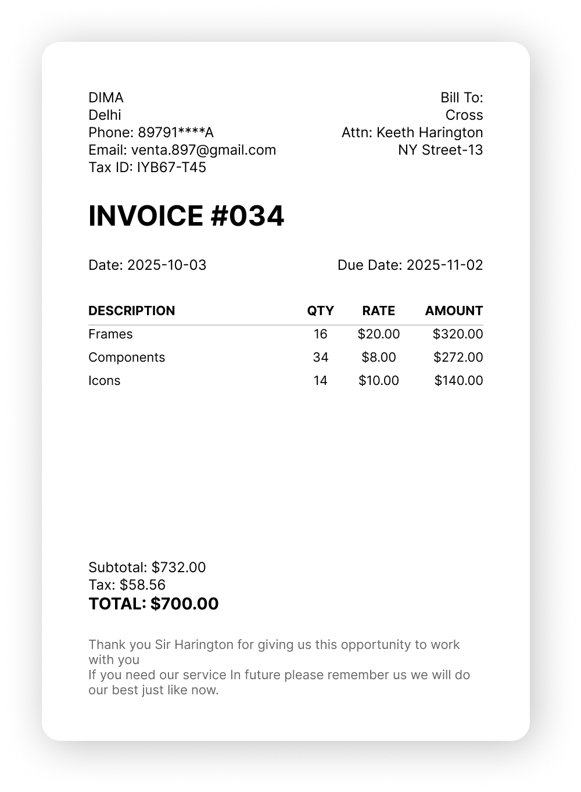

# Invo.ce - Invoice Generator for Figma


*Professional invoices directly in Figma*

A simple and professional invoice generator plugin for Figma. Create beautiful invoices directly in your design workspace.

## Features

- 🚀 **Quick Setup** - Generate invoices in seconds
- 💰 **Multi-Currency** - Support for USD, EUR, GBP, JPY, and more
- 🎨 **Professional Design** - Clean, modern invoice templates
- 📝 **Customizable** - Add your logo, terms, and messages
- 🔢 **Auto Calculations** - Automatic tax, discount, and total calculations
- 🔒 **Privacy First** - All data stays on your computer

## Screenshots


*User-friendly interface with logo upload*


*Professional invoice output in Figma*

## How to Use

1. **Install** the plugin from Figma Community
2. **Open** Invo.ce from your plugins menu
3. **Upload** your company logo (optional)
4. **Fill** in company and client details
5. **Add** line items with descriptions and prices
6. **Adjust** tax rates and discounts
7. **Preview** your invoice
8. **Export** to Figma as a frame

## Supported Currencies

- USD ($) - US Dollar
- EUR (€) - Euro
- GBP (£) - British Pound
- JPY (¥) - Japanese Yen
- CAD (C$) - Canadian Dollar
- AUD (A$) - Australian Dollar
- CHF (CHF) - Swiss Franc
- CNY (¥) - Chinese Yuan
- INR (₹) - Indian Rupee
- BRL (R$) - Brazilian Real

## File Structure

```
Invo.ce/
├── manifest.json    # Plugin configuration
├── code.js          # Figma canvas logic
└── ui.html          # User interface
```

## Development

Want to contribute? Feel free to submit issues and pull requests!

## Support

Found a bug or have a feature request? [Open an issue](https://github.com/vaibhav2067/Invo.ce/issues)

## License

MIT License - feel free to use and modify!

---

*Made for freelancers and businesses who love designing in Figma*